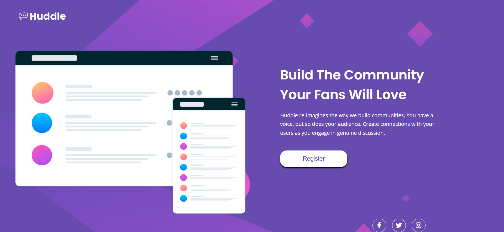
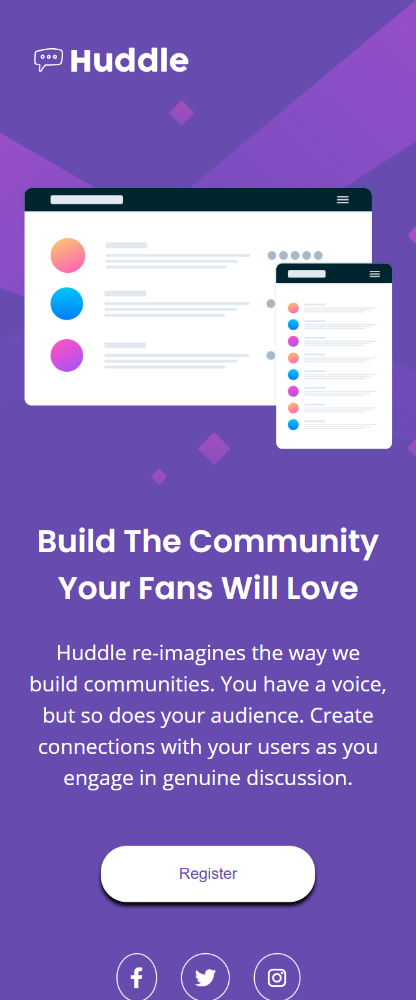

# huddle-landing-page-with-a-single-introductory-section

This project is a solution to the **Huddle landing page with a single introductory section** challenge on [Frontend Mentor](https://www.frontendmentor.io). It's a simple yet elegant design, focusing on responsive layouts and clean, accessible code.

## Overview

### The Challenge

The goal was to build a responsive landing page that matches the provided design. Key objectives included:

- Structuring the page with semantic HTML.
- Using CSS for styling and ensuring responsiveness across devices.
- Implementing hover states for interactive elements like buttons and social media links.

### Screenshot

## My Process

### Built With

- Semantic HTML5 markup
- CSS custom properties
- Flexbox for layout
- Responsive design principles
- Google Fonts for typography
- Font Awesome for social media icons

### What I Learned

This challenge helped reinforce the importance of structuring a project with reusability and scalability in mind. Some specific takeaways include:

- **CSS Variables:** Using `--violet` and `--magenta` for consistent colors throughout the project.
- **Responsive Design:** Switching the background image and adapting the layout for desktop screens with media queries.
- **Accessibility:** Ensuring links and buttons are keyboard-accessible and visually distinguishable on hover.

### Continued Development

In future projects, I aim to:

- Experiment more with CSS animations to add subtle interactivity.
- Explore advanced techniques for optimizing performance, like lazy-loading images.
- Improve semantic structure further with ARIA roles and landmarks.

## Author

- **Frontend Mentor Profile:** [Houari Aouinti](https://www.frontendmentor.io/profile/aouintihouari)
- **Twitter:** [@Houari_Aouinti](https://x.com/Houari_Aouinti)
